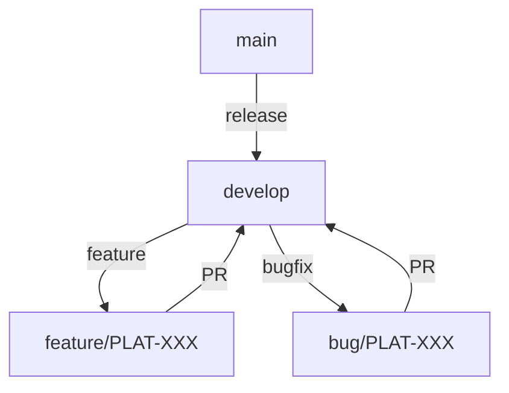

# Git Workflow Guidelines

## Branch Strategy 


### Branch Naming
- Feature branches: `feature/PLAT-XXX-short-description` vs `feature/PLAT-XXX`
- Bug fixes: `bug/PLAT-XXX-short-description` vs `bug/PLAT-XXX`
- Releases: `release/v8.x.y`

### Commit Message
```
feat(PLAT-XXX): add new data processing step

- Added new step for processing user data
- Implemented retry mechanism
- Added unit tests

Relating tickets:
- [PLAT-XXX]
- [PLAT-XXX]

#45321 - Commit / PR Link
BREAKING CHANGE: This change introduces a breaking change to the API
```

Q: Why use conventional commits? 
A: Conventional commits are a way to standardize commit messages. This allows for better tracking of changes and easier collaboration. Especially when using tools like [Commitizen](https://commitizen.github.io/cz-cli/) to help enforce the commit message format.

1. **Type**
   - `feat`: New feature
   - `fix`: Bug fix
   - `perf`: Performance improvement
   - `refactor`: Code refactor
   - `style`: Code style change
   - `docs`: Documentation update
   - `chore`: Maintenance task
   - `test`: Test update

2. **Scope**
   - `feat(PLAT-XXX)`: New feature for PLAT-XXX
   - `fix(PLAT-XXX)`: Bug fix for PLAT-XXX
   - `perf(PLAT-XXX)`: Performance improvement for PLAT-XXX
   - `refactor(PLAT-XXX)`: Code refactor for PLAT-XXX
   - `style(PLAT-XXX)`: Code style change for PLAT-XXX
   - `docs(PLAT-XXX)`: Documentation update for PLAT-XXX
   - `chore(PLAT-XXX)`: Maintenance task for PLAT-XXX
   - `test(PLAT-XXX)`: Test update for PLAT-XXX

3. **Subject**
   - Use the subject line to describe the changes in a concise manner
   - Use the imperative tense
   - Keep it short and descriptive under 50 characters

4. **Body**
   - Use bullet points
   - Describe how and why
   - Include impact and testing details

5. **Footer**
   - Reference issues or PRs
   - Use `BREAKING CHANGE` for breaking changes

### Pull Requests
- Title: `[PLAT-XXX]: Brief description`
- Template:
  ```markdown
  ## Description
  Brief description of changes

  ## Type of Change
  - [ ] Bug fix
  - [ ] New feature
  - [ ] Breaking change
  - [ ] Documentation update

  ## Testing
  - [ ] Unit tests added
  - [ ] Integration tests added
  - [ ] Manually tested

  ## Screenshots
  (if applicable)
  ```

### Merge Strategy
- Requires two (2) approvals

### Release Process
- Create release branch from `main`
- Bump version in `package.json`
- Add release notes
- Push to `main`
- Create GitHub release

### Branch Protection
- Require PRs for all changes
- Require status checks to pass
- Require code reviews
- Require tests to pass
- Require linting to pass
- Require signing off on release commits

### Code Reviews
- All changes require code reviews
- Reviews should focus on:
  - Code quality
  - Correctness
  - Completeness
  - Readability
  - Reusability
  - Maintainability
  - Performance
  - Security
  - Documentation